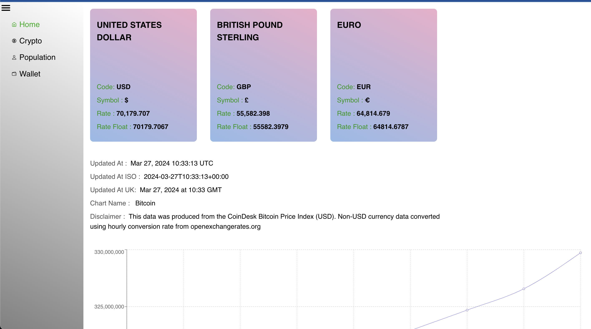
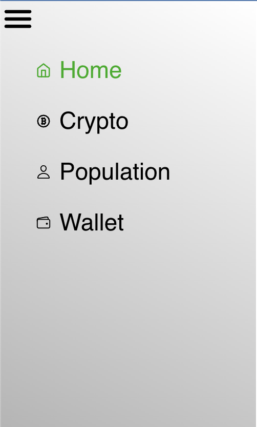
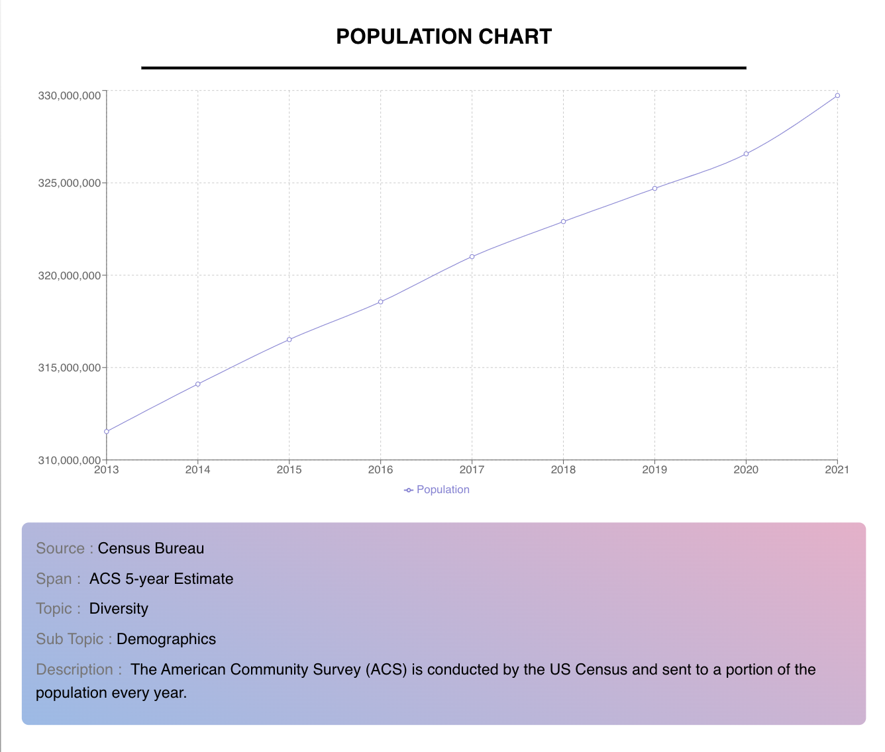

# Pioneer Labs Frontend Assignment

Reactify Dashboard is a sleek frontend project powered by React.js, Axios, React Fetch, Module CSS, and Recharts. Experience efficient data fetching, encapsulated styling, and stunning data visualization in a responsive design.

**Key Features**

- React.js Framework: Modular and scalable development with React.js.
- Efficient Data Handling: Axios and React Fetch for seamless data fetching.
- Encapsulated Styling: Module CSS ensures organized and customizable styling.
- Stunning Visualization: Recharts for interactive and beautiful data presentation.
- Responsive Design: Enjoy a seamless experience across devices and screen sizes.

**Components**
- Home Page

- Side Navbar

- Crypto Prices Page

-Population Chart Page

