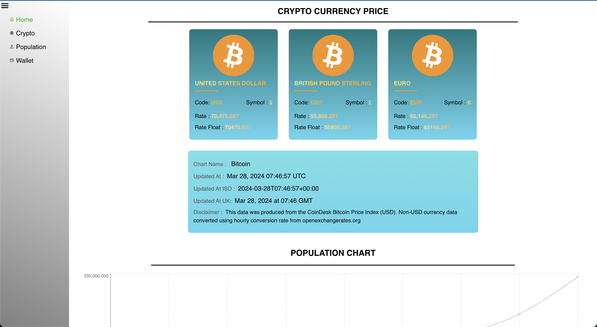
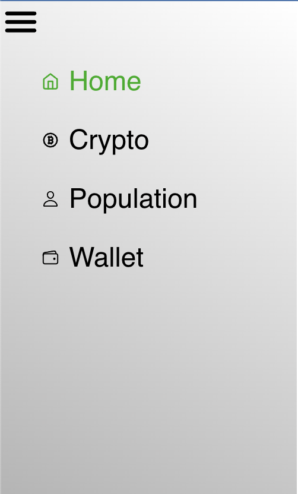
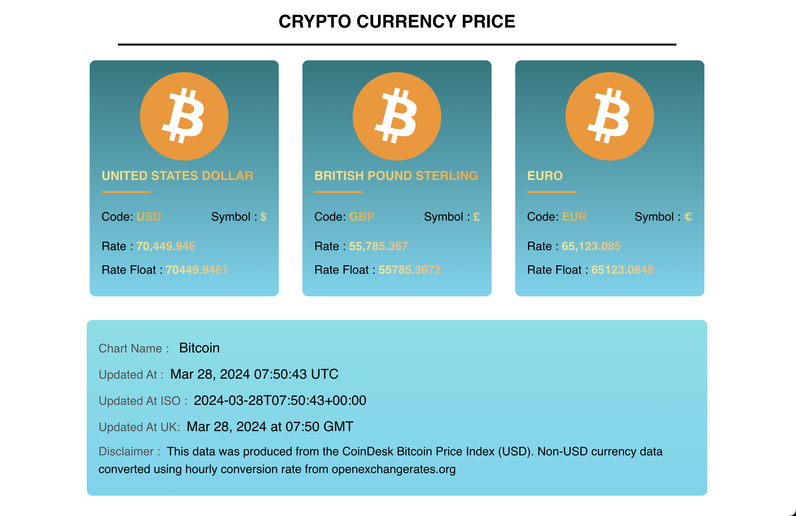
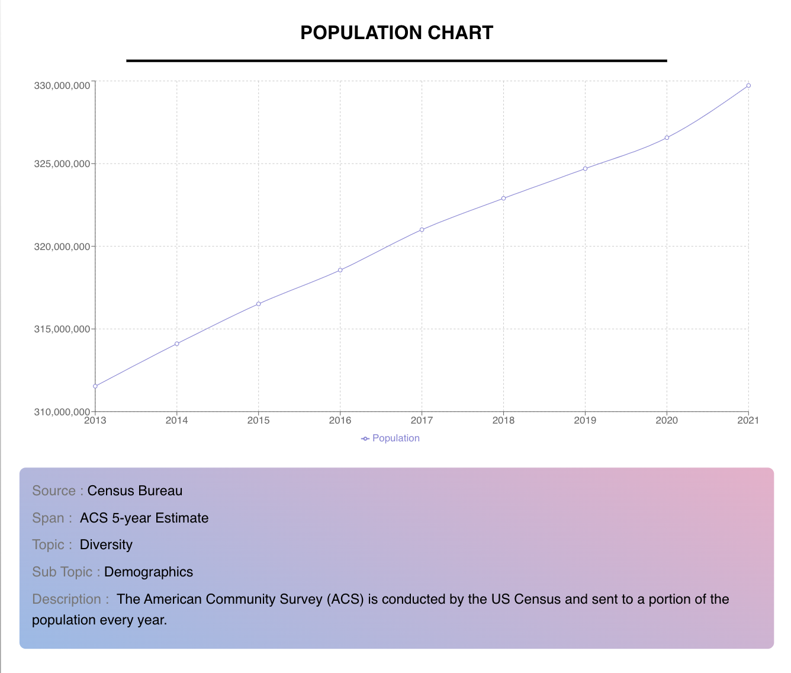

# Pioneer Labs Frontend Assignment

Deployed link - https://pioneer-labs-assignment.vercel.app/
 
Explanation Video Link - https://drive.google.com/file/d/1zO_9tDDuhEMoR1EFR20OmylHzuqYZ03p/view?usp=sharing

Reactify Dashboard is a sleek frontend project powered by React.js, Axios, React Fetch, Module CSS, and Recharts. Experience efficient data fetching, encapsulated styling, and stunning data visualization in a responsive design.

**Key Features**

- React.js Framework: Modular and scalable development with React.js.
- Efficient Data Handling: Axios and React Fetch for seamless data fetching.
- Encapsulated Styling: Module CSS ensures organized and customizable styling.
- Stunning Visualization: Recharts for interactive and beautiful data presentation.
- Responsive Design: Enjoy a seamless experience across devices and screen sizes.

**Components**

**Home Page**
- Features all the Components Created in this app

**Side Navbar**

- Responsive
- Indicates the active Page
- Smooth Animations
- Retracts when the hamburger icon Is Clicked

**Crypto Prices Page**
- Responsive Design with flex
- Gradient Finish
- Responsive

**Population Chart Page**
- Chart Made Using Recharts
- Smooth animations
- Clear Data Visualisation
- Responsive

